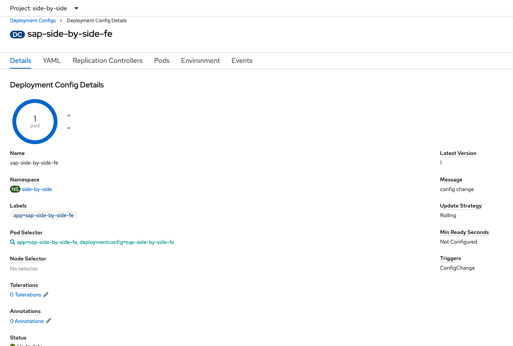
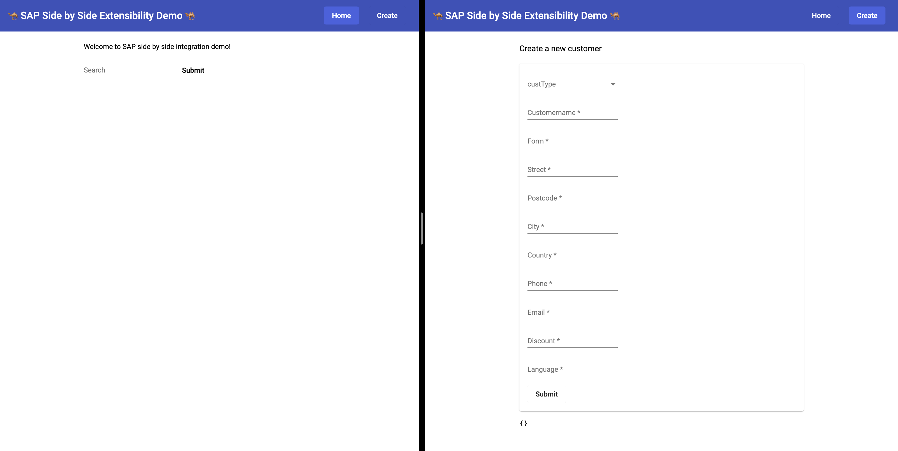

# Exercise 3: Consume previous exposed API via custom Angular frontend microservice

This scenario will show how we can build custom cloud-native applications that can be integrated with our SAP systems using the integration we have configured in the previous use case. To do that this workshop provides a running frontend microservice based on [this repository](https://github.com/redhat-sap/sap-side-by-side-fe). This will use Angular, a TypeScript-based open-source web application framework, to develop a simple microservice that will consume the exposed APIs from our backend microservice from the previous use case and present the data coming from S/4HANA and HANA to the user.

Let's identify the frontend microservice and get the external exposed URL for it. In the Project Overview, you can see the +Inventory+ section on the bottom left. From that section click on `Deployment Configs`. You can get to the same place using the `Workloads -- Deployment Configs` menu. Once you get there, you will see 2 different Deployment Configs. The one associated with the frontend microservice is `sap-side-by-side-fe`. If you click on it, you will be able to see more details like the number of Pods running for this Deployment Config or the container image used which is `quay.io/redhat-sap-cop/sap-side-by-side-fe:v1.0.0` by the time these instructions where written.

You can review more details from this Pod, check the actually used resources or check the logs coming from the Pod to see if everything looks fine, so you get familiar with it, as you can come back later to the Pod and see these values again once you start hitting the exposed API endpoints in the microservice.

Let's review now how to access the exposed URL for this microservice which will present the web interface for the user. Click on +Networking -- Routes+ menu and you will see 2 different routes available. The one specific for the backend microservice is called `sap-side-by-side-fe`. You can click on the exposed URL referred in the `Location` column.

Once you click in the URL link this will be opened in your default browser. There are 2 different pieces configured in this frontend. Both can be accessed using the links from the top right corner. The Home link will present the form to query customers from the SAP FLIGHT schema in HANA, using the customers GET method from the backend API in Fuse. The `Create` link will present the form to create customers in the SAP FLIGHT schema in HANA, using the customers' POST method from the backend API in Fuse.

To demonstrate the functionality and the whole flow, we are going to create a customer first, and then search for this new customer to ensure we can retrieve it. In the background, the Angular frontend will consume the exposed API from the Fuse backend, which is retrieving the information from S/4HANA via JCo, which is getting this info from FLIGHT schema in SAP HANA.

When filling the information not all the fields are mandatory. You can create a new customer just providing values for `custType, Customername` and `Street` (you can use your name as `Customername):

Once we have created the new customer, click on the Home link to use the form that will search for existing customers and try to find the one we have just created to ensure this has been added to the database. You can use wildcards to search for the customer.

You should get the information from the customer, demonstrating again the whole flow, getting information from the SAP HANA schema from a custom frontend microservice deployed in OpenShift.