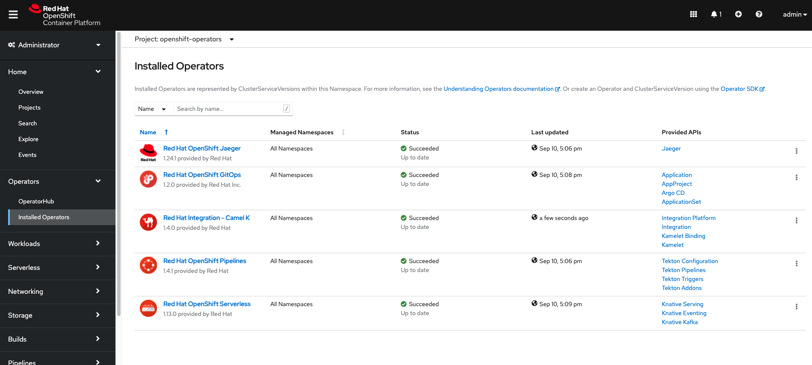

# Exercise 4: Serverless Integration

Using Red Hat Integration Portfolio and Red Hat Openshift to integrate with SAP side-by-side using an event-driven system and OpenShift Serverless.

# Intro

This workshop can be used to demonstrate the integration capabilities for Red Hat Integration portfolio with SAP's Digital Core. 

Using Openshift Serverless we can build scenarios where we do not need to have pods running constantly and they will be only scaled up when they receive a request and once they have served it they will be scaled out again. The requests and their results once they are served will be the events in this scenario.

# Architecture

The Red Hat Integration component that allows for serverless integration is Camel K and Openshift has an operator to install it on an OCP cluster. You can look at the Installed Operators in your cluster and you will see it on the list. Go to `Administrator` view and then click on `Operators -> Installed Operators`

This is the process flow of the scenario:

# 

Select the project `sap-serverless` in the `Administrator` view, change to `Developer` view and go to `Topology`

